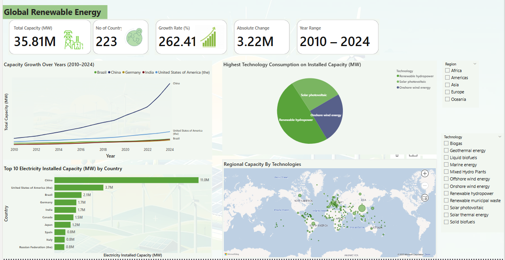

# Global Renewable Energy Access – SDG 7 Analysis

**Project Type:** Data Analysis · Global Development · Impact Analytics  
**Tools Used:** Excel · Python · Public Datasets (World Bank, UN SDG Tracker)

---

## Overview

This project explores progress toward **Sustainable Development Goal 7 (SDG 7)**: *Ensure access to affordable, reliable, sustainable and modern energy for all.*

Access to electricity is foundational for development yet over **700 million people** still live without it. Using global data, I analyzed access, inequality, and renewable progress across regions.

---

## Business & Social Questions Answered

- Which countries and regions have the **lowest access to clean electricity**?
- How has **renewable energy usage** changed over the last decade?
- What regions are showing the **most improvement** in solar or off-grid access?
- How is energy access linked to **GDP, geography, and urbanization**?
- What are the key **policy gaps** based on access trends?

---

## Key Insights

- **Sub-Saharan Africa** remains the region with the lowest electrification rates, especially in rural zones.
- Countries like **Bangladesh, Kenya, and India** have made surprising gains through solar and microgrid investment.
- Progress in **urban areas** far exceeds rural pointing to a growing infrastructure divide.
- In some regions, renewable energy adoption is declining due to policy rollbacks or economic instability.

---

## How It Was Built

- **Data Cleaning & Preprocessing** in Excel + Python (Pandas)
- Used **public datasets** from the World Bank, UN SDG Tracker, and Our World in Data
- Visualized trends and disparities through time series and heat maps
- Created **region-by-region summaries** of electrification and renewable usage

---

## Visual Preview

---

## File Access

- `Renewable_Cleaned_Pbix.xlsx` – Cleaned and transformed dataset  
- `sdg7_insights.ipynb` – Python notebook with trend charts and calculations  
- `access_by_country.csv` – Simplified table for visualizations

---

##  About Me

**Rejoice Nwocha** – Data Analyst & Insight Huntress  
Passionate about using data to address real-world challenges — from local business performance to global energy inequality.

🔗 [LinkedIn](https://linkedin.com/in/rejoice-nwocha)

---
